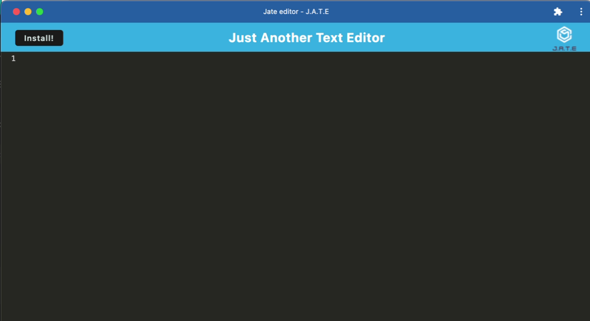

# Text-Editor App

## Description

As an aspiring developer, I wanted an application that I can write code in and use offline for practicing my skills so I build this application for just such a purpose.
In building this text editor, my understanding of progressive web apps and the methodologies involved has grown, and I feel confident in creating these in the future!

## Table of Contents (Optional)

- [Text-Editor App](#text-editor-app)
  - [Description](#description)
  - [Table of Contents (Optional)](#table-of-contents-optional)
  - [Installation](#installation)
  - [Usage](#usage)
  - [Credits](#credits)
  - [License](#license)
  - [Badges](#badges)
  - [Features](#features)
  - [How to Contribute](#how-to-contribute)
  - [Tests](#tests)

## Installation

1. Run `npm i`
2. Start the app using `npm run start`
3. The app can be downloaded using the button on the nav bar

## Usage

Site URL: https://chilling-hollow-81866-706cb69d59e8.herokuapp.com/

JATE can be used in the browser, or you can download the app to use it offline. 
You can enter text in the prompt box and it will be saved into IndexDB

## Credits

Tutor: Dominique Meeks Gombe

Starter Code: https://github.com/coding-boot-camp/cautious-meme/tree/main/Develop

Resources:
1. [Heroku](https://www.heroku.com/)
2. [IndexedDB](https://developer.mozilla.org/en-US/docs/Web/API/IndexedDB_API/Using_IndexedDB)
3. [Webpack](https://webpack.js.org/)

## License

## Badges

## Features

1. Browser use and offline use via downloaded app
2. Text editing
3. Saves in indexedDB

## How to Contribute

N/A

## Tests

N/A